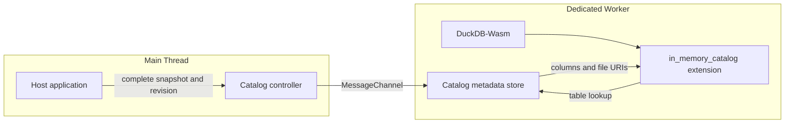

# DuckDB-Wasm In-Memory Catalog

Publish application-owned table metadata as a read-only DuckDB catalog in the browser.

[**Live demo**](https://tokibi.github.io/duckdb-wasm-in-memory-catalog/) · [MIT License](LICENSE)

The application supplies complete schema, table, column, scanner, and file URI metadata. A Dedicated Worker validates each published revision and exposes table descriptors to the `in_memory_catalog` Wasm extension on demand.

Each table declares how its files should be scanned. File URIs only identify where those files are located; the Catalog does not infer a scanner from a filename, extension, or URI shape.



## Live demo

The GitHub Pages demo publishes a small hosted fixture at `data/demo.parquet`. The browser inserts that same-origin HTTPS URL into the Catalog snapshot and explicitly declares the table scanner. DuckDB-Wasm then reads the file through its configured HTTP filesystem when SQL touches the table.

The DuckDB-Wasm runtime and default Catalog start automatically when the page opens. The demo shows the hosted fixture URL, row count, size, and columns alongside the runtime state. The Catalog JSON contains the resolved Pages URL, scanner configuration, and fixture content hash directly, and both the Catalog JSON and SQL remain editable before running a query.

```text
Catalog metadata
      │
      ├─ scanner.type = parquet
      └─ files[].uri = https://tokibi.github.io/duckdb-wasm-in-memory-catalog/data/demo.parquet
                    │
                    ▼
                DuckDB-Wasm
                    │
                    │ configured filesystem
                    ▼
                GitHub Pages
```

## Snapshot contract

Each publication contains a uint64 revision and a complete snapshot. A newer revision atomically replaces the current snapshot, the same revision with identical content is idempotent, and stale or conflicting revisions are rejected without changing the current state.

`table.snapshot` is the cache-version identity for that table. The host must change it whenever the bytes or physical Parquet schema represented by the table's files change. The global catalog revision is intentionally not used for file cache versioning: changing an unrelated table therefore does not change this table's scan path.

`format_version: 2` requires every table to declare a scanner explicitly. The Catalog never chooses a scanner from `files[].uri`.

Enumeration returns schema names, table names, and column definitions without copying file URIs into DuckDB-Wasm. Table lookup returns the file descriptors for the referenced table only. Catalog mutation statements are rejected because the application remains the metadata authority.

Example snapshot:

```js
{
  format_version: 2,
  schemas: [{
    name: 'analytics',
    tables: [{
      name: 'events',
      snapshot: 'events-r42',
      scanner: {
        type: 'parquet',
        options: {},
      },
      columns: [
        { name: 'id', type: 'BIGINT', nullable: false },
        { name: 'category', type: 'VARCHAR', nullable: true },
      ],
      files: [
        { uri: 'https://example.test/files/events-r42' },
      ],
    }],
  }],
}
```

## Scanner and file contract

A table separates three concerns:

```text
columns      how the table appears to DuckDB
scanner      how the files are interpreted
files[].uri  where the files are located
```

The scanner is table-level because all files that form one table are expected to share the same read configuration. `scanner.options` is part of the contract so scanner-specific settings can be added without moving format information into each file descriptor.

The current implementation supports:

```js
scanner: {
  type: 'parquet',
  options: {},
}
```

Non-empty Parquet options and other scanner types are currently rejected. CSV and other scanners can be added by defining their supported options and scan implementation while keeping the same table/file structure.

The current Parquet scanner validates the physical schema against the published column count, order, names, and types.

### Scan URI and cache identity

The host-supplied `files[].uri` is retained unchanged in catalog metadata. When the Parquet scan is bound, the extension derives a DuckDB-facing URI from that URI and the table's `snapshot`:

```text
metadata URI:
  https://example.test/files/events

DuckDB scan URI:
  https://example.test/files/events#duckdb-snapshot=events-r42
```

For HTTP(S) URIs, the snapshot is percent-encoded and appended as the internal `duckdb-snapshot` fragment parameter. An existing fragment is preserved byte-for-byte and the internal parameter is appended with `&`; an empty existing fragment (`#`) receives the parameter directly. Non-HTTP(S) URIs are passed to DuckDB unchanged. The same table snapshot produces the same scan path, while a changed table snapshot produces a different path. Catalog revision changes alone do not change it.

The fragment is local to DuckDB's file and Parquet metadata caches. URL fragments are not sent in HTTP requests, so the gateway or Service Worker still receives the base URI. This prevents reuse of DuckDB cache entries across table snapshots, but it cannot make a mutable remote resource version-aware while an older query is still issuing requests. Applications must serialize publishing a content-changing snapshot with queries that read the affected table (a query must not span the content update). If concurrent cross-revision queries are required, the remote gateway must expose a version identity it can observe, such as a query parameter or immutable path.

## Runtime ownership

The host application owns the DuckDB Worker and database lifecycle. It creates the Worker, initializes DuckDB-Wasm, then initializes the Catalog controller with the Worker, database, initial revision, and snapshot.

Closing the controller detaches the Catalog and drops its Worker-side snapshot without terminating the Worker.

## Repository layout

```text
extensions/in_memory_catalog/       DuckDB extension build definition
src/in_memory_catalog_extension.cpp extension implementation
src/javascript/                     controller and Dedicated Worker runtime
demo/                               GitHub Pages browser demo
scripts/build-wasm.sh               pinned Wasm extension build
scripts/build-pages.mjs             self-contained Pages artifact build
scripts/serve-pages.mjs             local Range-capable Pages preview
test/unit/                           JavaScript component contracts
```

DuckDB and Emscripten versions are pinned in `versions.lock`.

## Development

Requirements:

- Node.js 22
- Git submodules
- Emscripten 3.1.56 for Wasm builds

```sh
git clone --recurse-submodules https://github.com/tokibi/duckdb-wasm-in-memory-catalog.git
cd duckdb-wasm-in-memory-catalog
npm install
npm test
make build-wasm
```

The Wasm artifact is written to:

```text
build/wasm_eh/extension/in_memory_catalog/in_memory_catalog.duckdb_extension.wasm
```

To build and preview the same static artifact published by GitHub Pages:

```sh
make build-wasm
npm run build:pages
npm run serve:pages
```

Then open `http://127.0.0.1:4175/`.

## Status

Experimental. The public API is still evolving.

## License

MIT
