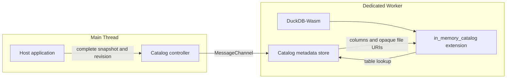

# DuckDB-Wasm In-Memory Catalog

Publish application-owned table metadata as a read-only DuckDB catalog in the browser.

[**Live demo**](https://tokibi.github.io/duckdb-wasm-in-memory-catalog/) · [MIT License](LICENSE)

The application supplies complete schema, table, column, and file URI metadata. A Dedicated Worker validates each published revision and exposes table descriptors to the `in_memory_catalog` Wasm extension on demand.

File URIs are opaque to this component. It does not resolve provider locators, manage credentials, fetch remote objects, or cache file contents. Those responsibilities can be supplied by Browser Remote File Gateway or any ordinary HTTP(S) server without changing the Catalog contract.



## Live demo

The GitHub Pages demo shows the Catalog without Browser Remote File Gateway or any Service Worker.

The Pages build publishes a generated Parquet fixture at `data/demo.parquet`. The browser inserts that same-origin HTTPS URL into the Catalog snapshot, then DuckDB-Wasm reads the Parquet file through its normal HTTP filesystem when SQL touches the table.

The demo lets you edit both the Catalog JSON and SQL before running the query. `$DEMO_FILE` resolves to the Pages-hosted Parquet URL and `$DEMO_CONTENT_VERSION` resolves to the generated fixture hash.

This makes the transport boundary explicit:

```text
Catalog metadata
      │
      │ files[].uri = https://tokibi.github.io/duckdb-wasm-in-memory-catalog/data/demo.parquet
      ▼
DuckDB-Wasm
      │
      │ ordinary HTTPS / HTTP Range
      ▼
GitHub Pages
```

No Service Worker or Remote File Gateway is involved.

## Snapshot contract

Each publication contains a uint64 revision and a complete snapshot. A newer revision atomically replaces the current snapshot, the same revision with identical content is idempotent, and stale or conflicting revisions are rejected without changing the current state.

Enumeration returns schema names, table names, and column definitions without copying file URIs into DuckDB-Wasm. Table lookup returns the URI descriptors for the referenced table only. Catalog mutation statements are rejected because the application remains the metadata authority.

Example snapshot:

```js
{
  format_version: 1,
  schemas: [{
    name: 'analytics',
    tables: [{
      name: 'events',
      snapshot: 'events-r42',
      columns: [
        { name: 'id', type: 'BIGINT', nullable: false },
        { name: 'category', type: 'VARCHAR', nullable: true },
      ],
      files: [
        { uri: 'https://example.test/events-r42.parquet' },
      ],
    }],
  }],
}
```

## File contract

The current scan implementation loads DuckDB's Parquet dependency and validates each Parquet file against the published column count, order, names, and types.

Parquet is a consumer constraint of the current Catalog integration, not part of the file URI or remote-storage contract.

## Runtime ownership

The host application owns the DuckDB Worker and database lifecycle. It creates the Worker, initializes DuckDB-Wasm, then initializes the Catalog controller with the Worker, database, initial revision, and snapshot.

Closing the controller detaches the Catalog and drops its Worker-side snapshot without terminating the Worker.

## Repository layout

```text
extensions/in_memory_catalog/       DuckDB extension build definition
src/in_memory_catalog_extension.cpp extension implementation
src/javascript/                     controller and Dedicated Worker runtime
demo/                               GitHub Pages browser demo
scripts/build-wasm.sh               pinned Wasm extension build
scripts/build-pages.mjs             self-contained Pages artifact build
scripts/serve-pages.mjs             local Range-capable Pages preview
test/unit/                           JavaScript component contracts
```

DuckDB and Emscripten versions are pinned in `versions.lock`.

## Development

Requirements:

- Node.js 22
- Git submodules
- CMake for the native DuckDB demo fixture build
- Emscripten 3.1.56 for Wasm builds

```sh
git clone --recurse-submodules https://github.com/tokibi/duckdb-wasm-in-memory-catalog.git
cd duckdb-wasm-in-memory-catalog
npm install
npm test
make build-wasm
```

The Wasm artifact is written to:

```text
build/wasm_eh/extension/in_memory_catalog/in_memory_catalog.duckdb_extension.wasm
```

To build and preview the same static artifact published by GitHub Pages:

```sh
make build
make build-wasm
npm run build:pages
npm run serve:pages
```

Then open `http://127.0.0.1:4175/`.

## Status

Experimental. The public API is still evolving.

## License

MIT
