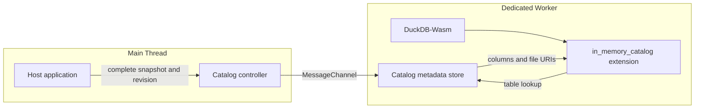

# DuckDB-Wasm In-Memory Catalog

Publish application-owned table metadata as a read-only DuckDB catalog in the browser.

[**Live demo**](https://tokibi.github.io/duckdb-wasm-in-memory-catalog/) · [**Documentation**](https://tokibi.github.io/duckdb-wasm-in-memory-catalog/docs/) · [**日本語ドキュメント**](https://tokibi.github.io/duckdb-wasm-in-memory-catalog/docs/ja/) · [MIT License](LICENSE)

The host application supplies complete schema, table, column, scanner, and file metadata. A Dedicated Worker validates each published revision and exposes table descriptors to the `in_memory_catalog` Wasm extension on demand.

Use it when your application already owns a declarative dataset model and you want DuckDB-Wasm to query that model as a normal catalog instead of synchronizing it through procedural DDL.



## Documentation

The user documentation is organized as:

- **Getting started** — initialize DuckDB-Wasm and attach the first catalog.
- **Guides** — publish, update, query, and operate catalogs.
- **Concepts** — catalog revisions, table snapshots, scanners, cache identity, and runtime ownership.
- **Reference** — snapshot format, JavaScript API, errors, limitations, and development commands.

See the [English documentation](https://tokibi.github.io/duckdb-wasm-in-memory-catalog/docs/) or [日本語ドキュメント](https://tokibi.github.io/duckdb-wasm-in-memory-catalog/docs/ja/).

## Development

Requirements:

- Node.js 22
- pnpm 10.17.1
- Git submodules
- Emscripten 3.1.56 for Wasm builds

```sh
git clone --recurse-submodules https://github.com/tokibi/duckdb-wasm-in-memory-catalog.git
cd duckdb-wasm-in-memory-catalog
corepack enable
pnpm install --frozen-lockfile
pnpm test
make build-wasm
```

Build and preview the same static artifact published by GitHub Pages:

```sh
pnpm build:pages
pnpm serve:pages
```

Then open `http://127.0.0.1:4175/`. The demo is at `/` and the documentation is at `/docs/`.

## Repository layout

```text
extensions/in_memory_catalog/       DuckDB extension build definition
src/in_memory_catalog_extension.cpp extension implementation
src/javascript/                     controller and Dedicated Worker runtime
demo/                               GitHub Pages browser demo
docs/                               Ox Content user documentation
scripts/build-wasm.sh               pinned Wasm extension build
scripts/build-pages.mjs             demo artifact build
scripts/serve-pages.mjs             local Range-capable Pages preview
test/unit/                           JavaScript component contracts
```

DuckDB and Emscripten versions are pinned in `versions.lock`.

## Status

Experimental. The public API is still evolving.

## License

MIT
