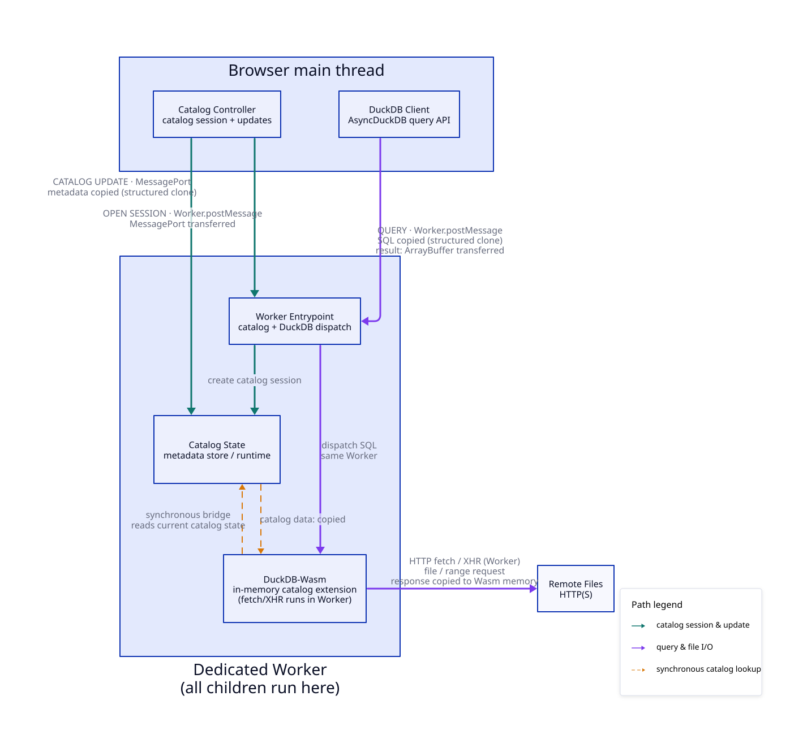

# DuckDB-Wasm In-Memory Catalog

アプリケーションが管理するテーブルメタデータを、ブラウザ上の読み取り専用 DuckDB カタログとして公開します。

ホストアプリケーションが schema、table、column、scanner、file のメタデータを JSON 形式の宣言的なスナップショットとして渡し、DuckDB-Wasm にカタログとして認識させます。アプリケーション側のデータモデルを `CREATE TABLE` の列定義として手動で二重管理する必要はありません。

---

## 解決する課題

ブラウザ上で DuckDB-Wasm を利用してリモートファイルを分析する場合、従来の構成では以下の問題が生じます。

| 観点 | 従来のアプローチ | In-Memory Catalog |
|---|---|---|
| **カタログ定義** | `CREATE TABLE` や `CREATE VIEW` などの手続き型 DDL を逐次発行 | メタデータの JSON スナップショットを宣言的に渡す |
| **Source of Truth** | アプリケーション状態と DuckDB カタログの2箇所に分散 | アプリケーションが単一の Source of Truth |
| **データの更新** | テーブルの削除・再作成による競合リスク | 専用 Worker による全体更新・単一テーブル置換の直列化 |
| **HTTP キャッシュ** | ファイルやスキーマ変更時に古いキャッシュが残る問題 | スナップショット識別子によるキャッシュ分離（`#duckdb-snapshot=...`） |
| **SQL クエリ** | クエリごとに長いファイルURLやパーサー関数を指定 | 通常のテーブル参照（`SELECT * FROM app.analytics.events`） |

---

## Lakehouse format との関係

Apache Iceberg や Delta Lake などの Lakehouse format が利用できる環境であれば、ストレージ側でメタデータや履歴を管理できるそれらの形式を採用する方が適しています。

本ライブラリの目的は、ストレージ側にそうした専用フォーマットや管理基盤が存在しない場合でも、スキーマ定義、列情報、ファイル URL リストといった、アプリケーションがメモリ上に持つ軽量なデータ構造をそのまま table や view の定義として DuckDB-Wasm に公開し、クエリ可能にすることです。

---

## 主な機能

- ⚡ **宣言的なカタログ公開**: アプリケーション管理のメタデータを読み取り専用 DuckDB カタログとして公開。
- 📦 **マルチフォーマット対応**: Parquet、CSV、JSON、XLSX の各ファイル形式をサポート。
- 🔄 **アトミックな更新**: Dedicated Worker がカタログ全体の一括更新（`publishSnapshot`）や単一テーブルの置換（`replaceTable`）を直列化して適用。
- 🛡️ **キャッシュ分離**: テーブル単位の snapshot identity を URL フラグメントとして付与し、リモート URL を変えずに DuckDB のキャッシュを制御。
- 🔍 **SQL View サポート**: テーブルに加えて宣言的な SQL ビューを登録可能。更新時には自動で依存関係を再バインド。
- 🧵 **メインスレッドの負荷軽減**: メタデータの検証や管理は Dedicated Worker 内で行われ、UI スレッドの描画処理を妨げません。

---

## アーキテクチャの概要

1. **ホストアプリケーション**: メタデータを保持し、カタログ全体のスナップショットまたは単一テーブルの更新をコントローラーへ渡します。
2. **Dedicated Worker**: DuckDB-Wasm とカタログメタデータストアが同一の Web Worker 内で動作します。
3. **`in_memory_catalog` Wasm 拡張機能**: DuckDB のテーブル解決時に、Worker 内のストアからスキーマとスキャン用 URI を同期的に取得します。
4. **DuckDB-Wasm**: 解決された URI を用いて、リモートファイルへ直接 HTTP Range リクエストを発行してクエリを実行します。

---

## ドキュメントの構成

- [**はじめに**](./getting-started.md): ランタイムのセットアップ、アセットの配置、初期化とクエリ実行手順。
- [**ガイド**](./guides.md): カタログの公開、テーブルやビューの更新、クエリの実行、クリーンアップなどのレシピ。
- [**コンセプト**](./concepts.md): 完全スナップショット、テーブルスナップショット、キャッシュ分離の仕組み、読み取り専用である理由。
- [**スキャナ**](./scanners.md): Parquet、CSV、JSON、XLSX の各スキャナの設定方法と利用可能なオプション一覧。
- [**リファレンス**](./reference.md): スナップショットの JSON スキーマ定義、JavaScript API の詳細、エラーハンドリング、制約事項。

[**ライブデモ**](../../) では、ブラウザ上で実際にスナップショットを編集しながら SQL クエリを実行できる環境を提供しています。

> [!NOTE]
> このプロジェクトは experimental であり、公開 API は今後変更される可能性があります。
